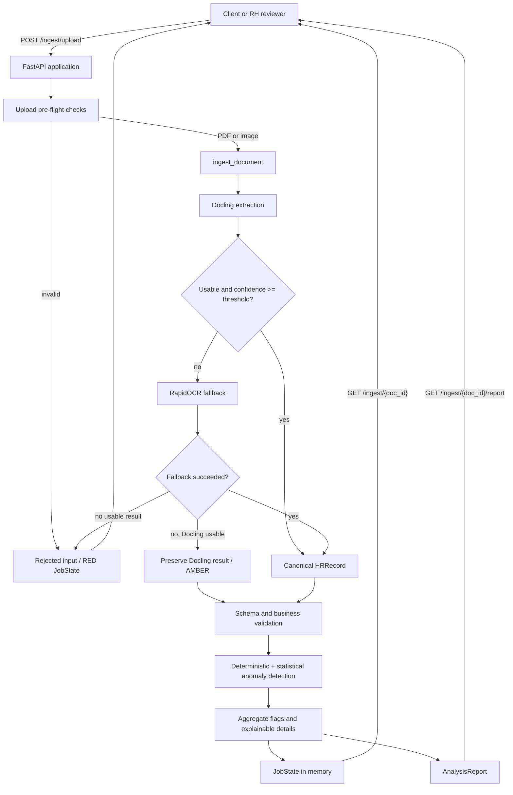
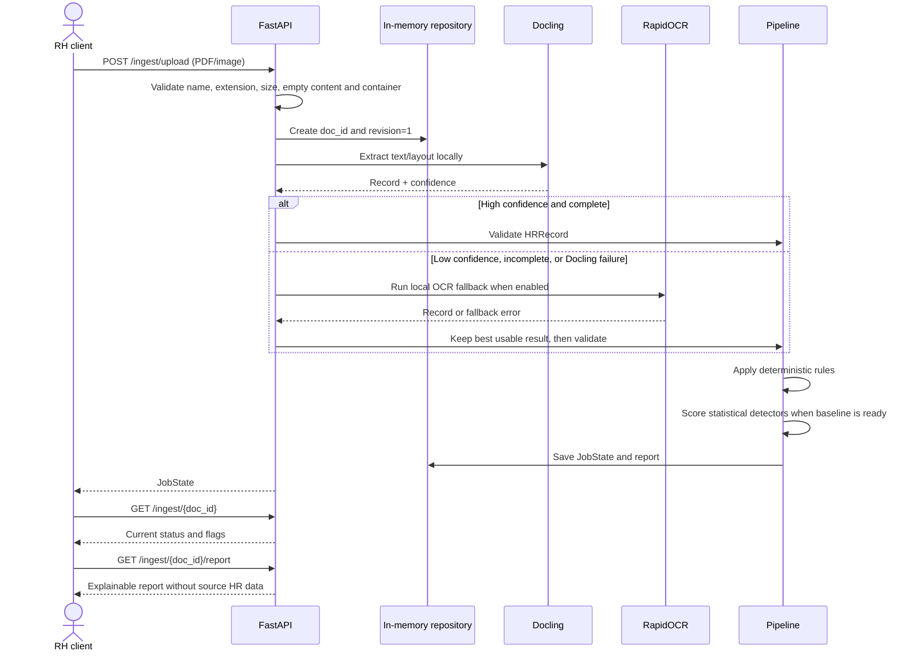
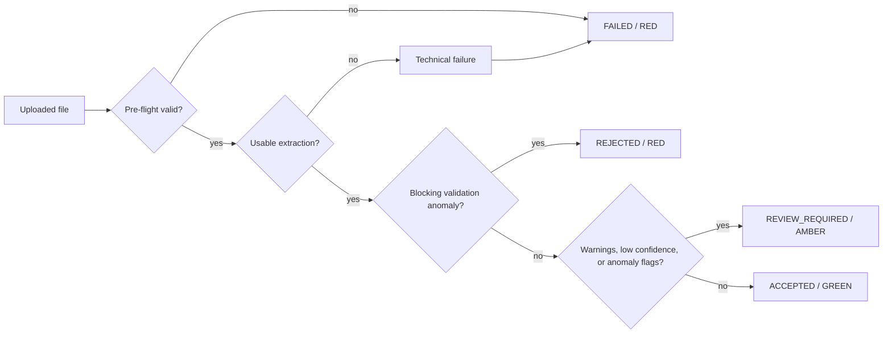
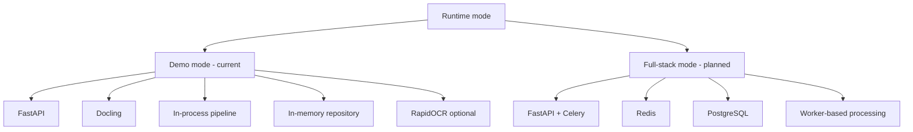

# HR Anomaly Detection Pipeline

Local, self-hosted pipeline for checking anonymised HR documents before a
human reviewer decides whether they can be integrated into an HR information
system (SIRH). The current runtime is a synchronous FastAPI demo using an
in-memory repository. It does not require Redis, PostgreSQL, Celery, Ollama,
or a cloud API.

The project is deliberately human-in-the-loop: extraction and anomaly
detection produce explainable signals, but no record is automatically sent to
a SIRH.

## Architecture at a glance



## End-to-end workflow



## Processing decisions

The current internal `JobState.statut` values are:

| Status | Meaning |
|---|---|
| `green` | Usable extraction and no blocking validation status. |
| `amber` | Usable result exists, but confidence, completeness, or review signals require a human. |
| `red` | No usable result or a blocking validation/processing result. |

The report maps these internal values to stable business labels:

| Report status | Meaning |
|---|---|
| `ACCEPTED` | No blocking anomaly is present. Human approval is still required. |
| `REVIEW_REQUIRED` | A usable result has warnings or non-blocking anomalies. |
| `REJECTED` | A critical or blocking data result prevents integration. |
| `FAILED` | A technical failure prevented analysis. |



## What is implemented

### Input and extraction

Current supported formats are PDF and common image formats:

```text
.pdf .png .jpg .jpeg .webp .tif .tiff .bmp
```

The pre-flight stage checks:

- filename and extension;
- empty files;
- maximum size (10 MiB by default);
- PDF signature;
- image readability and corruption.

Docling is the primary local extractor. RapidOCR is an optional local
fallback. If RapidOCR fails but Docling produced a usable record, the Docling
record is preserved and marked for review.

CSV and Excel are not supported by the current runtime. They need a separate
tabular ingestion and schema contract rather than being passed through OCR.

### HR validation and anomaly detection

The canonical model is `app.ingestion.schemas.HRRecord`. The current payroll
profile expects these fields when available:

```text
nom, cin, cnss, date_embauche, salaire_brut
```

Rules include:

- missing or whitespace-only required values;
- CIN, CNSS, date, and salary format validation;
- invalid date ordering and future birth dates;
- negative salary and impossible working hours;
- unknown employee status values;
- active employee with an exit date;
- duplicate and statistical signals through the existing anomaly layer when a
  cohort baseline is available.

Anomaly details contain a rule, severity, expected condition, explanation,
remediation, detector, and score. Sensitive values are masked in report
details.

## Runtime modes



| Dependency | Demo mode | Full-stack mode |
|---|---:|---:|
| FastAPI | required | required |
| Docling | required | required |
| RapidOCR | optional | optional |
| Redis | not used | planned/required |
| PostgreSQL | not used | planned/required |
| Celery | not used | planned/required |

## Run from WSL

Do not use PowerShell or CMD for Python commands. Start from the Windows
terminal only to enter WSL, then run all project commands inside WSL.

```text
PS C:\Users\amessaoud\Desktop\hr-anomaly-scaffold> wsl
amessaoud@host:/mnt/c/Users/amessaoud/Desktop/hr-anomaly-scaffold$ source .venv/bin/activate
```

Verify that the existing project environment is active:

```bash
which python
python --version
python -m pip --version
```

Expected paths contain:

```text
/mnt/c/Users/amessaoud/Desktop/hr-anomaly-scaffold/.venv/bin/python
```

Do not create a new environment. Do not install packages globally. The
repository already declares its dependencies in `pyproject.toml`; use the
existing `.venv` and install only into that environment if dependencies are
missing.

### Start the API

Verify the application factory in `app/main.py` and start the supported demo
runtime:

```bash
python -m uvicorn app.main:create_app --factory \
  --host 0.0.0.0 --port 8000
```

The API is then available at `http://127.0.0.1:8000`.

For the interactive OpenAPI page, open `http://127.0.0.1:8000/docs`.

### Check health

Use a second WSL terminal, activate the same environment, and run:

```bash
source .venv/bin/activate
curl -sS http://127.0.0.1:8000/health/live
curl -sS http://127.0.0.1:8000/health/ready
```

`/health/live` checks that the process is alive. `/health/ready` checks the
hard demo dependency (Docling) and reports optional RapidOCR degradation.

## Run a sample upload

The repository contains synthetic PDF files under `data/synthetic/`. They are
for local testing only and must not be replaced by real HR documents.

```bash
curl -sS -X POST http://127.0.0.1:8000/ingest/upload \
  -F "file=@data/synthetic/hr_record_01.pdf"
```

Copy the returned `doc_id`, then query the job and report:

```bash
export DOC_ID="replace-with-returned-doc-id"
curl -sS "http://127.0.0.1:8000/ingest/${DOC_ID}"
curl -sS "http://127.0.0.1:8000/ingest/${DOC_ID}/report"
```

The upload response and polling response use the stable `JobState` shape:

```json
{
  "doc_id": "uuid",
  "revision": 1,
  "statut": "green",
  "confiance": 0.95,
  "flags": [],
  "erreur_traitement": null
}
```

The report endpoint does not return the original HR record. It returns the
document/job identifiers, processing timestamp, status, anomaly counters,
explanations, and recommendations.

## Test the system

All tests are deterministic and run locally. They do not require Internet,
Azure, Redis, PostgreSQL, or an external API.

### Full test suite

```bash
source .venv/bin/activate
which python
python --version
python -m pip --version
python -m pytest -q
```

### Focused tests

```bash
python -m pytest -q tests/ingestion
python -m pytest -q tests/anomalies
python -m pytest -q tests/api tests/pipeline
```

Integration tests that require real OCR engines are marked `integration`:

```bash
python -m pytest -q -m integration
python -m pytest -q -m "not integration"
```

### Compile and quality checks

```bash
python -m compileall -q app tests
git diff --check
```

Ruff and mypy are configured in `pyproject.toml`. Run them when installed in
the active venv:

```bash
python -m ruff check .
python -m mypy app tests
```

## API workflow summary

| Step | Method | Endpoint | Purpose |
|---:|---|---|---|
| 1 | `GET` | `/health/live` | Check process liveness. |
| 2 | `GET` | `/health/ready` | Check runtime readiness. |
| 3 | `POST` | `/ingest/upload` | Upload and synchronously analyse a document. |
| 4 | `GET` | `/ingest/{doc_id}` | Retrieve the stable job state. |
| 5 | `GET` | `/ingest/{doc_id}/report` | Retrieve the privacy-conscious report. |

Unknown document IDs return `404`. Invalid or empty uploads return a stable
`JobState` with a red status and a controlled error code.

## Repository map

```text
app/
├── main.py                         FastAPI factory and application entrypoint
├── api/                            HTTP routes and health endpoints
├── core/                           Settings and readiness checks
├── ingestion/                      IDs, upload checks, OCR and pipeline tasks
├── anomalies/                      Cohorts, detectors and anomaly orchestrator
└── pipeline/                       Validation, status composition and reports
tests/                              Unit, API, OCR and integration tests
data/synthetic/                     Synthetic local PDF fixtures
docs/architecture.md                Long-form architecture
docs/runtime.md                     Runtime and endpoint contract
```

## Security and scope boundaries

- Never commit real HR documents or personal data.
- Never send real HR data to a cloud LLM or external OCR service.
- Keep human approval outside this pipeline; anomaly detection is advisory.
- Do not commit `.venv/`, `venv/`, `env/`, `__pycache__/`, `*.pyc`, or test
  caches.
- The full Celery/Redis/PostgreSQL runtime is planned, not shipped.

For detailed contracts and fallback semantics, see
[`docs/runtime.md`](docs/runtime.md). For the complete layer architecture,
see [`docs/architecture.md`](docs/architecture.md).
